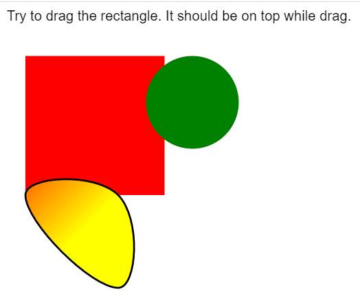

# React Konva
React Konva is a JavaScript library for drawing complex canvas graphics using [React](https://reactjs.org/)
# picture Demo

**to use portals in react-konva**

[Documentation](https://konvajs.org/docs/react/Canvas_Portal.html)